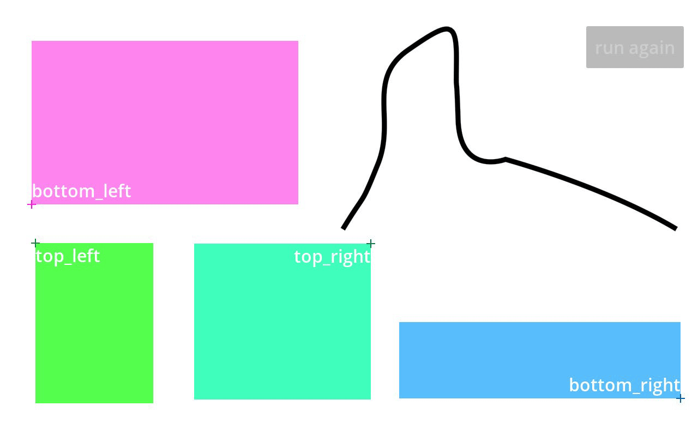

# godot-uberpath2d

A Path2D with smoothing, and utilities for restricting it to any Rect2D

# Demo



# Usage

Create a new node of type `UberPath2D`

Draw a path.

Check `Smooth` in the editor properties to smooth the path.

In code, restrict your path to a rect like so:

```gdscript
@onready var path: Path2D = $UberPath2D

var path_follow_2d: PathFollow2D = UberPath2D.get_bounded_path_follow_2d(
    $some_container_to_parent_new_nodes_to,
    sprite.get_path(),  # the sprite you want to move along the path
    path.normalized_points,
    rect,
    start_corner
)

# tween it!
await create_tween()\
    .tween_property(path_follow_2d, "progress_ratio", 1.0, 3.5).finished
```


start_corner` (type `Vector2i`) is one of
- (0,0) -> top left
- (1,1) -> bottom right
- (0,1) -> bottom left  [default]
- (1,0) -> top right