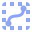

# godot-uberpath2d



A Path2D with smoothing, and utilities for restricting it to any Rect2


Now on the [official asset library](https://godotengine.org/asset-library/asset/2322).

# Demo


# Usage

Create a new node of type `UberPath2D`

Draw a path.

Check `Smooth` in the editor properties to smooth the path.

In code, restrict your path to a rect like so:

```gdscript
@onready var path: Path2D = $UberPath2D
@onready var sprite: Sprite = $my_sprite
var rect2: Rect2 = Rect2(0, 0, 500, 500)

var path_follow_2d: PathFollow2D = UberPath2D.get_bounded_path_follow_2d(
    self,  # or some other container to parent to
    sprite.get_path(),  # the sprite you want to move along the path
    path.normalized_points,
    rect2,
    UberPath2D.BOTTOM_LEFT,  # or some other corner, BOTTOM_LEFT is the default.
)

# tween it!
await create_tween()\
    .tween_property(path_follow_2d, "progress_ratio", 1.0, 3.5).finished
```

# Credit

Made by [Juan Uys](https://juanuys.com)

SmoothPath original Godot 3 code by [Dlean Jeans](https://ask.godotengine.org/32506/how-to-draw-a-curve-in-2d?show=57123#a57123)
